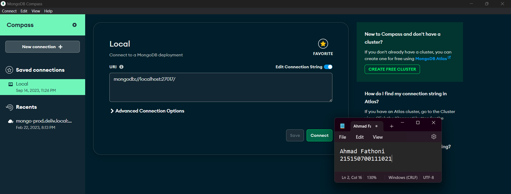
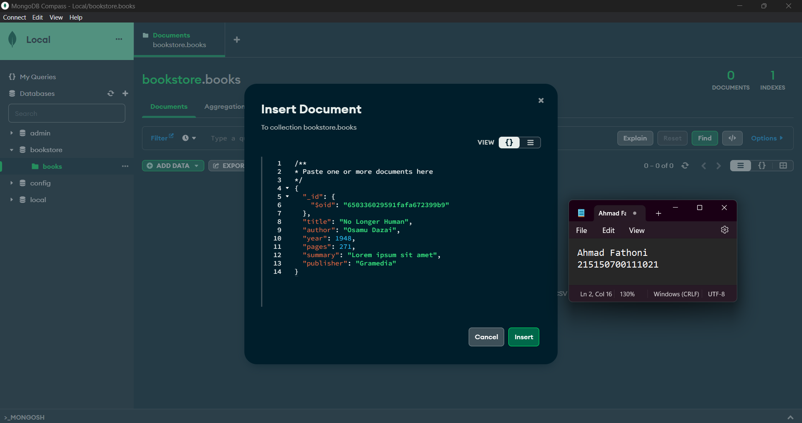

# :ledger: Praktikum CRUD MongoDB

Disini kumpulan code dan foto hasil Screenshot penerapan praktikum saya di modul 2 CRUD MongoDB.
## :memo: Dasar Teori
* ### MongoDB Compass
    MongoDB Compass adalah tool berbasis Graphical User Interface (GUI) yang digunakan untuk berinteraksi dengan MongoDB yang terpasang secara on-premise dan MongoDB Atlas yang berbasis cloud. Tool ini dapat melakukan aktivitas dasar seperti CREATE, READ, UPDATE, dan DELETE (CRUD) tanpa berhadapan dengan baris perintah (command line).

* ### MongoDB Shell
    Walaupun dapat melakukan operasi seperti MongoDB Compass, interaksi yang dilakukan MongoDB Shell berbasis Command Line Interface (CLI) sehingga diperlukan baris perintah untuk melakukan aktivitas dasar. MongoDB Shell dapat diakses langsung dari MongoDB Compass atau menggunakan mongosh pada Command Prompt.

## :scroll: Langkah Percobaan
* ### MongoDB Compass
    a. Melakukan koneksi ke MongoDB menggunakan connection string ``` mongodb://localhost:27017 ``` secara lokal. <br />
    

    b. Membuat Database bookstore dengan melakukan klik "Create Database" <br />
    

    c. Insert data buku pertama dengan melakukan klik "Add Data", pilih "Insert Document", isi data dengan data yang diinginkan, lalu klik "insert" <br />

    > :warning: **MongoDB akan membuat nilai _id secara otomatis**

    

    d. Insert data buku kedua dengan cara yang sama <br />
    

    e. Melakukan pencarian buku dengan ```author : "Osamu Dazai"``` dengan mengisi filter yang diinginkan dan klik button "Find"
    

    f. Update field ```summary``` pada buku "No Longer Human" menjadi ```Buku yang bagus (<NAMA>, <NIM>)``` dengan klik button Edit
    
        
    - Hasil update buku "No Longer Human"
     


    g. Menghapus buku "I Am a Cat" dengan klik button "delete"
    

    - Hasil delete buku "I Am a Cat"
     


* ### MongoDB Shell
    a. Melakukan konfigurasi di environtment variable untuk bisa menjalankan command ```mongosh``` di terminal
     


