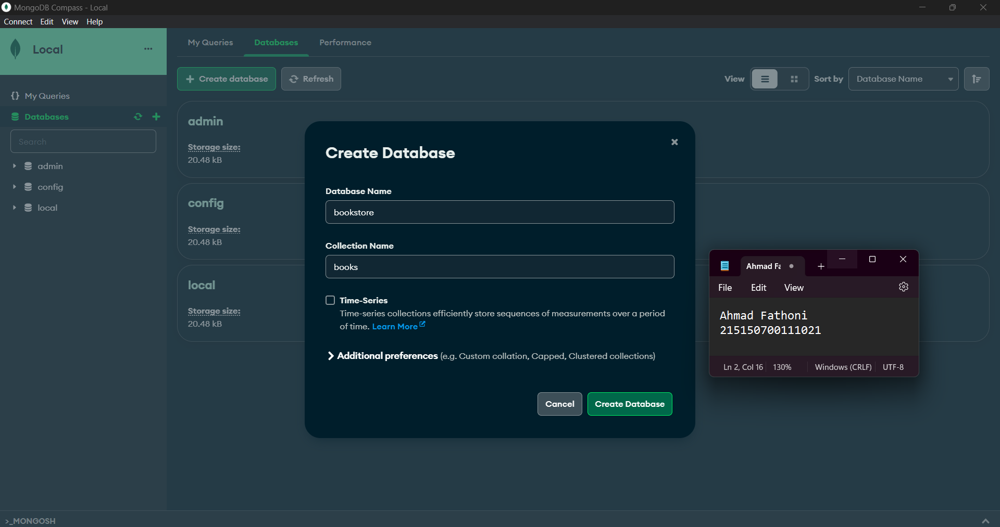
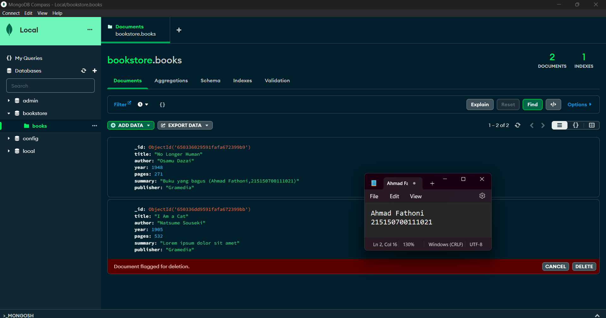
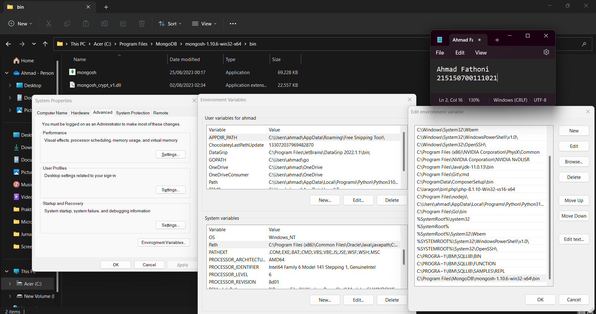
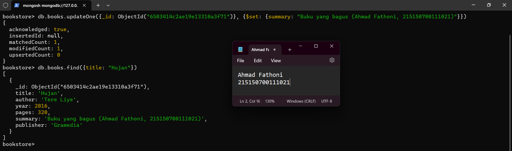
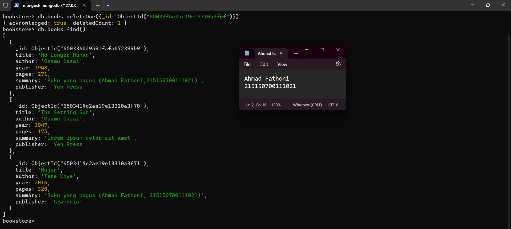

# :ledger: Praktikum CRUD MongoDB

Disini kumpulan code dan foto hasil Screenshot penerapan praktikum saya di modul 2 CRUD MongoDB.
## :memo: Dasar Teori
* ### MongoDB Compass
    <p style='text-align: justify;'> MongoDB Compass adalah tool berbasis Graphical User Interface (GUI) yang digunakan untuk berinteraksi dengan MongoDB yang terpasang secara on-premise dan MongoDB Atlas yang berbasis cloud. Tool ini dapat melakukan aktivitas dasar seperti CREATE, READ, UPDATE, dan DELETE (CRUD) tanpa berhadapan dengan baris perintah (command line). </p>

* ### MongoDB Shell
    <p style='text-align: justify;'> Walaupun dapat melakukan operasi seperti MongoDB Compass, interaksi yang dilakukan MongoDB Shell berbasis Command Line Interface (CLI) sehingga diperlukan baris perintah untuk melakukan aktivitas dasar. MongoDB Shell dapat diakses langsung dari MongoDB Compass atau menggunakan mongosh pada Command Prompt. </p>

## :scroll: Langkah Percobaan
* ### MongoDB Compass
    a. Melakukan koneksi ke MongoDB menggunakan connection string ``` mongodb://localhost:27017 ``` secara lokal. <br />
    

    b. Membuat Database bookstore dengan melakukan klik "Create Database" <br />
    

    c. Insert data buku pertama dengan melakukan klik "Add Data", pilih "Insert Document", isi data dengan data yang diinginkan, lalu klik "insert" <br />

    > :warning: **MongoDB akan membuat nilai _id secara otomatis**

    

    d. Insert data buku kedua dengan cara yang sama <br />
    

    e. Melakukan pencarian buku dengan ```author : "Osamu Dazai"``` dengan mengisi filter yang diinginkan dan klik button "Find"
    

    f. Update field ```summary``` pada buku "No Longer Human" menjadi ```Buku yang bagus (<NAMA>, <NIM>)``` dengan klik button Edit
    
        
    - Hasil buku "No Longer Human" sudah terupdate
     


    g. Menghapus buku "I Am a Cat" dengan klik button "delete"
    

    - Hasil buku "I Am a Cat" sudah terhapus
     


* ### MongoDB Shell
    a. Melakukan konfigurasi di environtment variable untuk bisa menjalankan command ```mongosh``` di terminal
    

    b. Koneksi ke MongoDB Server dengan menjalankan command ```mongosh``` di terminal windows
    

    c. Menjalankan beberapa command berikut : 
    
    :information_source: **Penjelasan :** 
    - ```show dbs``` : melihat isi database yang ada di server
    - ```use <database_name>``` : berpindah ke database yang diinginkan
    - ```show collection``` :  melihat collection yang ada pada database yang digunakan

    d. Insert satu data dengan command ```db.books.insertOne(<data yang dimasukkan>)```
    

    e. Insert banyak data dengan command ```db.books.insertMany(<data yang dimasukkan>)```
    

    f. Pencarian semua buku dengan command ```db.books.find()```
    

    g. Melakukan pencarian buku dengan ```author : "Osamu Dazai"``` dengan command ```db.books.find({<filter yang ingin diisi>})```
    

    h. Update field ```summary``` pada buku "Hujan" menjadi ```Buku yang bagus (<NAMA>, <NIM>)``` dengan command 
    ```db.books.updateOne({<filter>},{$set: {<data yang akan di update>}})```
    

    i. Update field ```publisher``` menjadi "Yen Press" pada beberapa buku menggunakan filter ```author : "Osamu Dazai"``` dengan 
    command ```db.books.updateMany({<filter>}, {$set: {<data yang akan di update>}})``` 
    

    j. Menghapus buku "Overlord I" dengan command ```db.books.deleteOne({<argument>})```
    

    k. Menghapus beberapa buku dengan menggunakan filter ```author : "Osamu Dazai"``` dengan command 
    ```db.books.deleteMany({<argument>})```
    
