# :ledger: MongoDB dan Express

Disini kumpulan code dan foto hasil Screenshot penerapan praktikum saya di modul 3 MongoDB dan Express.
## :memo: Dasar Teori
### Express
<p style='text-align: justify;'> Express.js adalah framework web app untuk Node.js yang ditulis dengan bahasa pemrograman JavaScript. Framework open source ini dibuat oleh TJ Holowaychuk pada tahun 2010 lalu. Express.js adalah framework back end. Artinya, ia bertanggung jawab untuk mengatur fungsionalitas website, seperti pengelolaan routing dan session, permintaan HTTP, penanganan error, serta pertukaran data di server. </p>

### Mongoose
<p style='text-align: justify;'> Mongoose adalah pustaka berbasis Node.js yang digunakan untuk pemodelan data pada MongoDB. Mongoose menyediakan feature diantaranya, model data application berbasis Schema. Dan juga termasuk built-in type casting, validation, query building, business logic hooks dan masih banyak lagi yang menjadi ke andalan mongoose. </p>

### Async Await
<p style='text-align: justify;'> Async sendiri merupakan sebuah fungsi yang mengembalikan sebuah Promise. Await sendiri merupakan fungsi yang hanya berjalan di dalam Async. Await bertujuan untuk menunda jalannya Async hingga proses dari Await tersebut berhasil dieksekusi. </p>

### Model
<p style='text-align: justify;'> Model merupakan bagian yang bertugas untuk menyiapkan, mengatur, memanipulasi, dan mengorganisasikan data yang ada di database. </p>

### Controller
<p style='text-align: justify;'> Controller merupakan bagian yang menjadi tempat berkumpulnya logika pemrograman yang digunakan untuk memisahkan organisasi data pada database. Dalam beberapa kasus, controller menjadi penghubung antara model dan view pada arsitektur MVC </p>

### Route
<p style='text-align: justify;'> Router mengatur pintu masuk yang berupa request pada aplikasi, mereka memilah dan mengolah request url untuk kemudian diproses sesuai dengan tujuan akhir url tersebut. Bisa jadi url tersebut berfungsi untuk mengambil data kemudian menampilkannya, menghapus data, menampilkan form, sampai mengolah session. </p>

## :scroll: Langkah Percobaan
### Instalasi NODE JS
<!-- > :information_source: **NOTE : Disini saya sudah melakukan instalasi NODE JS, jika belum melakukan instalasi harap mendownload node setup di https://nodejs.org/en dan menjalankannya.** -->
> [!NOTE]
> Disini saya sudah melakukan instalasi NODE JS, jika belum melakukan instalasi harap mendownload node setup di https://nodejs.org/en.
1. Setelah instalasi NodeJS selesai, jalankan command ```node -v``` untuk memeriksa apakah NodeJS sudah terinstall dan menampilkan versi NodeJS
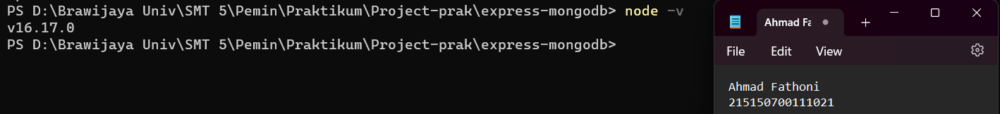

### Inisiasi project Express dan pemasangan package
1. Membuat folder dengan nama express-mongodb dan buka lewat tekx editor VS Code
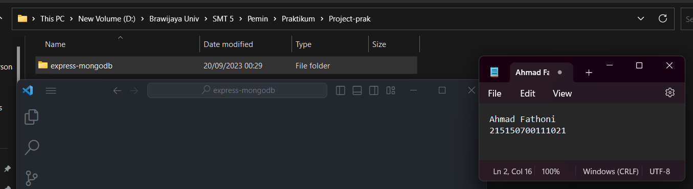

2. Melakukan npm init untuk menggenerate file package.json dengan command ```npm init -y```
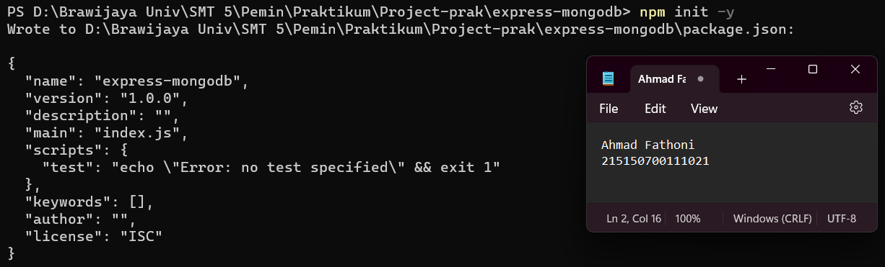

3. Melakukan instalasi express, mongoose, dan dotenv dengan command ```npm i express mongoose dotenv```
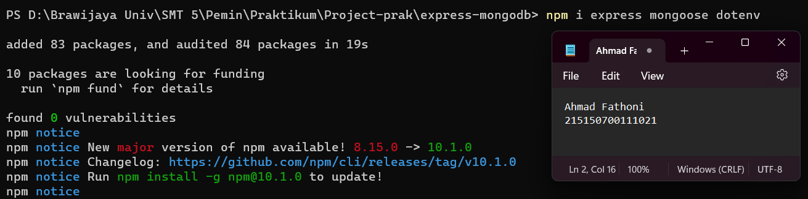

### Koneksi Express ke MongoDB
1. Membuat file index.js pada root folder, lalu memasukkan script seperti pada gambar dan mencoba menjalankannya dengan command ```node index.js```
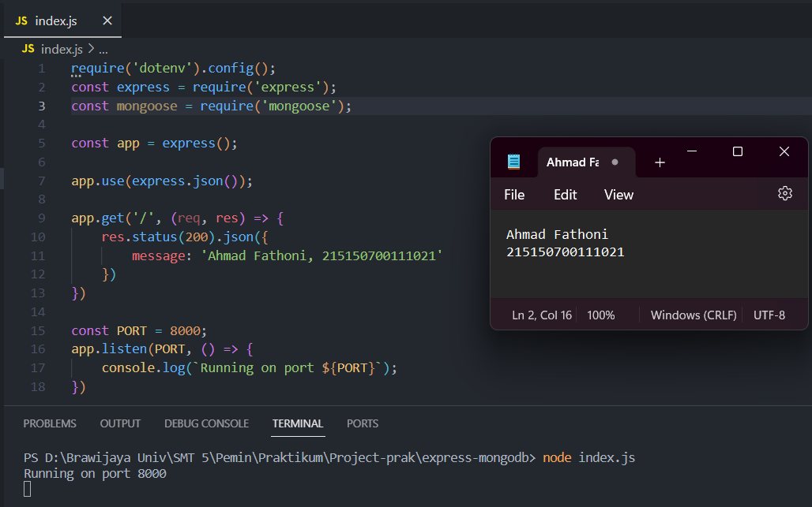

2. Membuat file **.env** dan memasukkan script pada file **.env** seperti pada gambar, lalu merubah listening port dengan mengambil PORT dari file **.env**, untuk lebih jelasnya bisa dilihat pada gambar dibawah ini. Setelah itu coba dijalankan lagi.
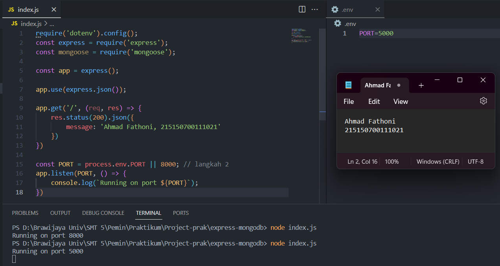
> [!IMPORTANT]
> maka akan terjadi perubahan PORT yang awalnya 8000 menjadi 5000 sesuai dengan value dari PORT yang ada di file .env

3. menambahkan ```MONGO_URI``` pada file **.env** dan isi value nya dengan connection string yang terdapat pada MongoDB Compass. Lalu tambahkan baris kode di file **index.js** seperti pada gambar di bawah.
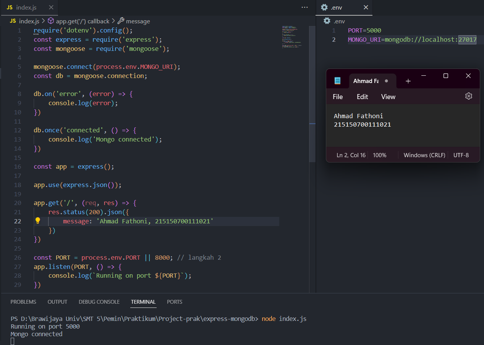
> [!IMPORTANT]
> Saat dijalankan, seharusnya terdapat "Mongo connected" pada console log

### Pembuatan routing 
1. Membuat direktori routes, lalu buat file **book.route.js** serta mengisikan kode untuk fungsi getAllBooks, getOneBook, createBook, updateBook, dan deleteBook seperti pada gambar dibawah.
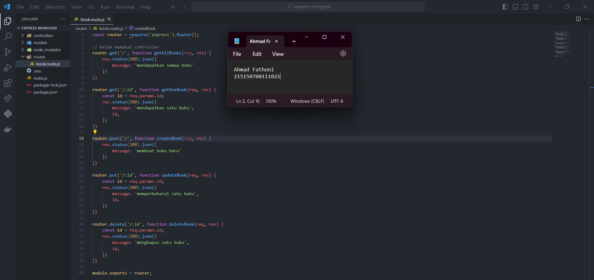

2. Melakukan import **book.route.js** pada file index.js dan menambahkan kode : 
``` 
const bookRoutes = require('./routes/book.route');

app.use('/books', bookRoutes);
```
&nbsp;&nbsp;&nbsp;&nbsp;&nbsp;kode tersebut untuk membuat routing pada endpoint books dengan ```/books``` di awal url.<br />

&nbsp;&nbsp;&nbsp;&nbsp;&nbsp;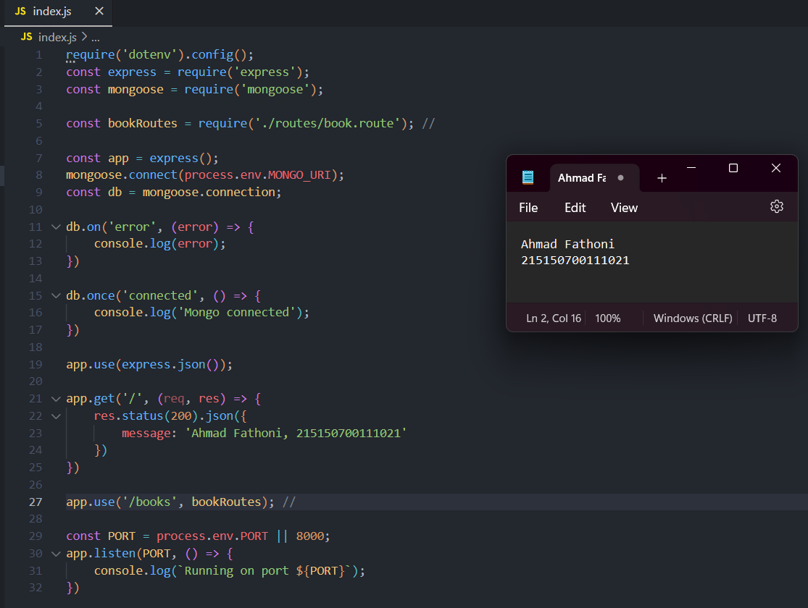

3. Menguji salah satu endpoint dengan Postman. <br />
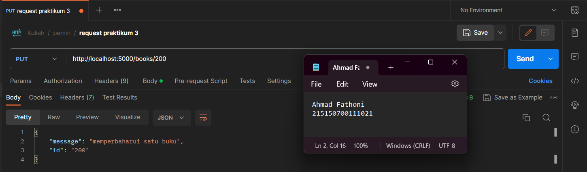

### Pembuatan controller
1. Membuat direktori controllers, lalu buat file **book.controller.js** serta mengisikan kode untuk fungsi getAllBooks, getOneBook, createBook, updateBook, dan deleteBook seperti pada gambar di bawah.
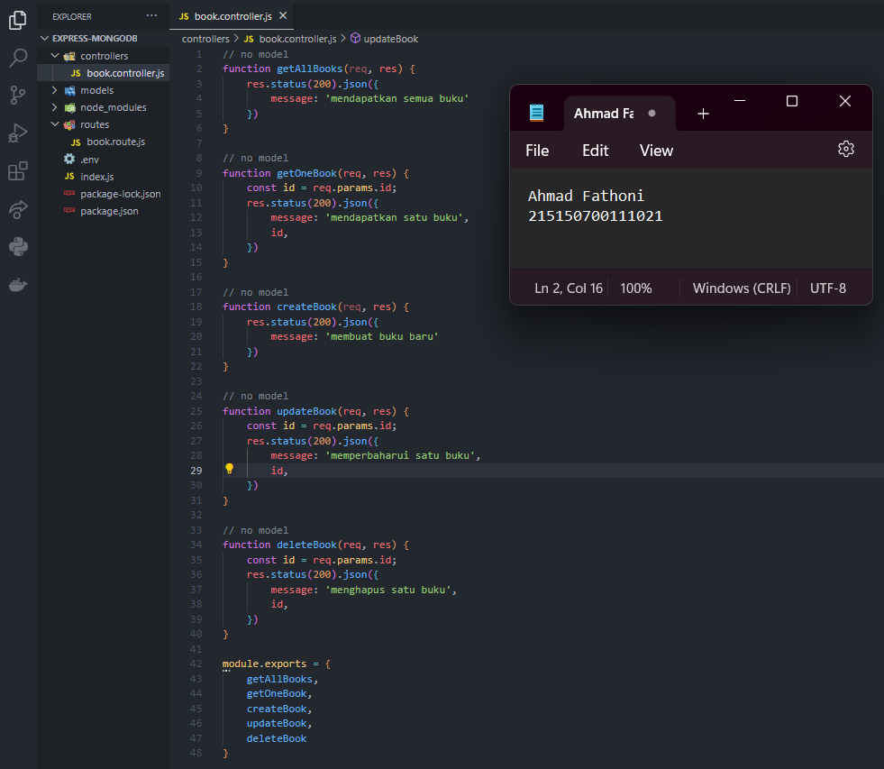

2. Melakukan import **book.controller.js** pada file book.route.js, serta melakukan perubahan pada fungsi getAllBooks, getOneBook, createBook, updateBook, dan deleteBook seperti pada gambar yang ada di bawah.
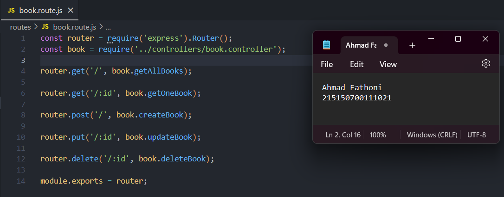

3. Melakukan pengujian kembali pada Postman dengan endpoint yang sama dan pastikan response tetap sama
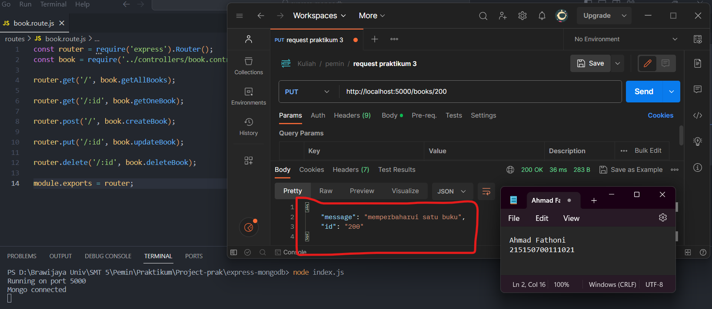

### Pembuatan model
variable | tipe data |
--- | --- |
title | string |
author | string |
year | number |
pages | number |
summary | string |
publisher | string |
1. Membuat direktori models, lalu buat file **book.model.js** serta mengisikan baris kode sesuai dengan tabel di atas, untuk lebih jelasnya bisa dilihat pada gambar.
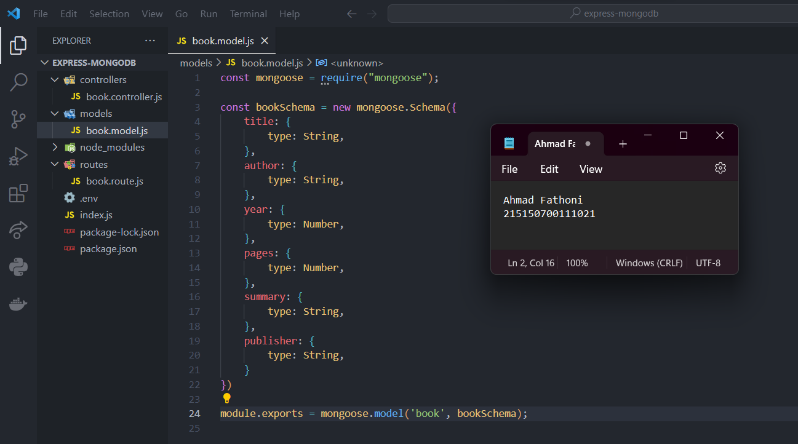

### Operasi CRUD
1. Menghapus semua data pada collection books yang sudah dibuat di praktikum sebelumnya.
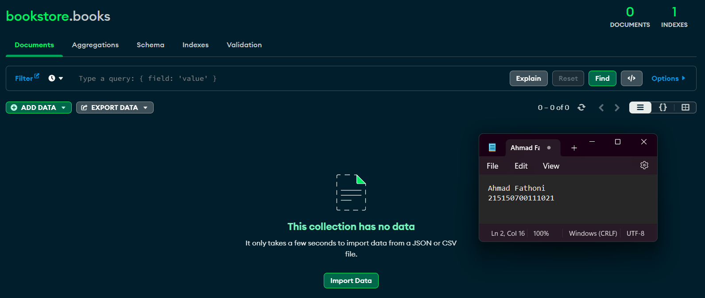

2. Import **book.model.js** pada file **book.controller.js**, lalu rubah fungsi createBook seperti pada gambar di bawah.
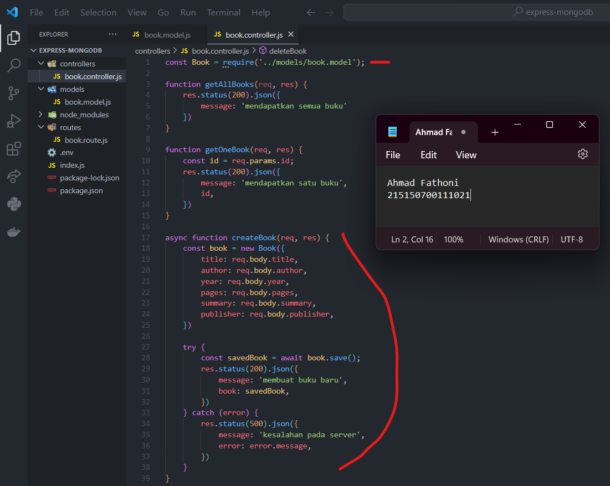

3. Eksekusi endpoint untuk create buku dengan mengisikan dua data buku dengan data di bawah ini menggunakan Postman : 
```
{
    "title": "Dilan 1990",
    "author": "Pidi Baiq",
    "year": 2014,
    "pages": 332,
    "summary": "Mirea, anata wa utsukushī",
    "publisher": "Pastel Books"
}
```
```
{
    "title": "Dilan 1991",
    "author": "Pidi Baiq",
    "year": 2015,
    "pages": 344,
    "summary": "Watashi ga kare o aishite iru to ittara",
    "publisher": "Pastel Books" 
}
```
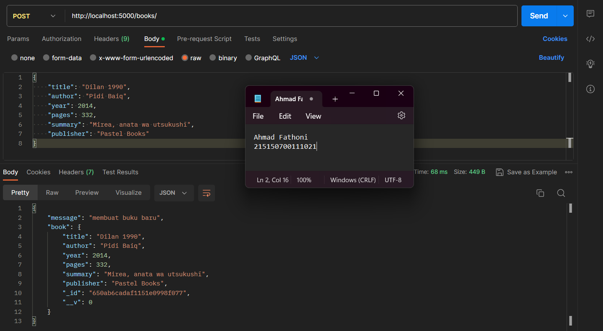
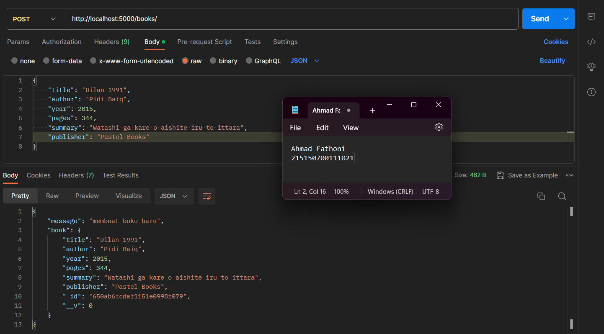

4. Melakukan perubahan pada fungsi getAllBooks dan getOneBook di controller seperti pada gambar dibawah.
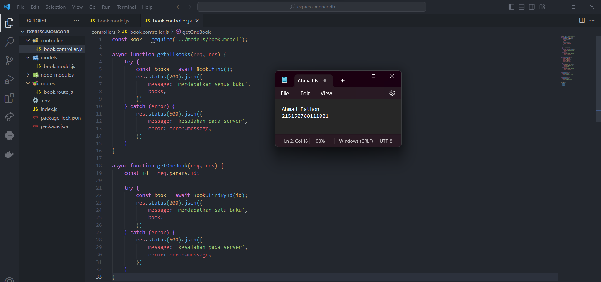

5. Eksekusi endpoint untuk menampilkan semua data buku dan menampilkan satu data buku.
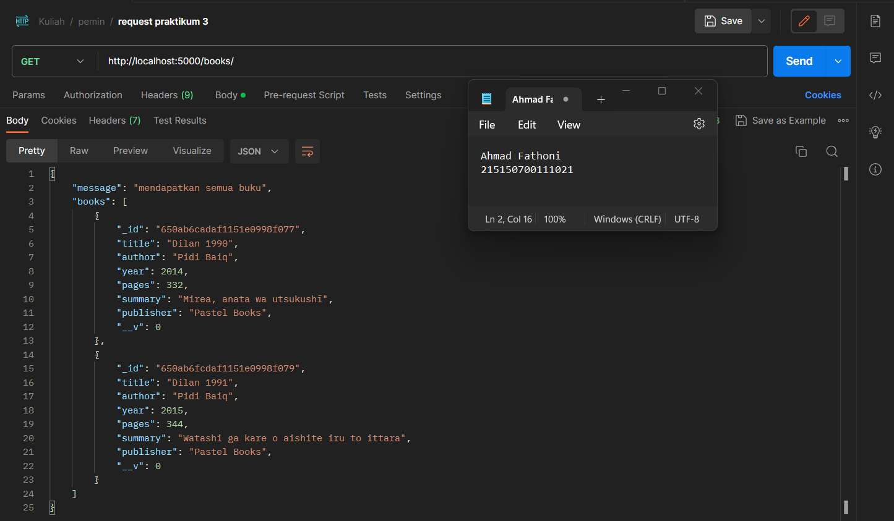
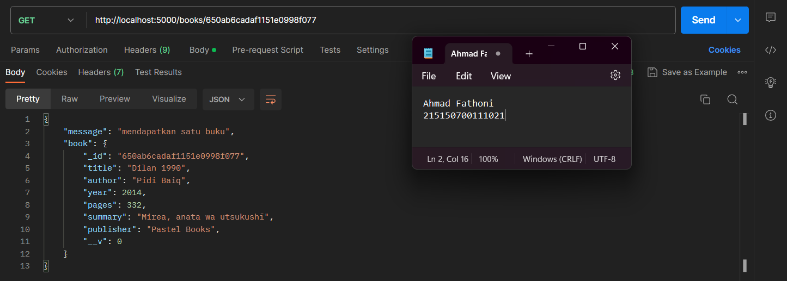

6. Melakukan perubahan pada fungsi updateBook di controller seperti pada gambar di bawah.
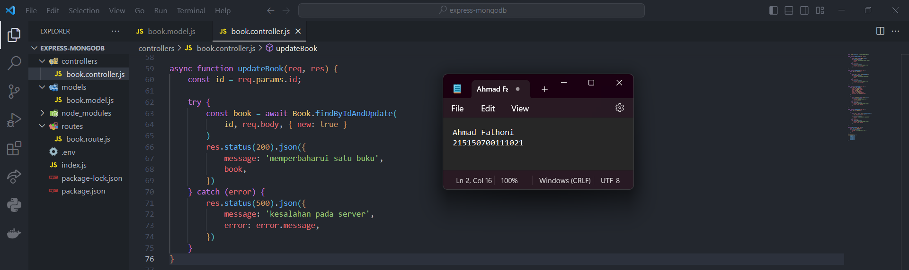

7. Eksekusi endpoint untuk update buku Dilan 1991 menjadi ```<NAMA PANGGILAN> 1991``` 
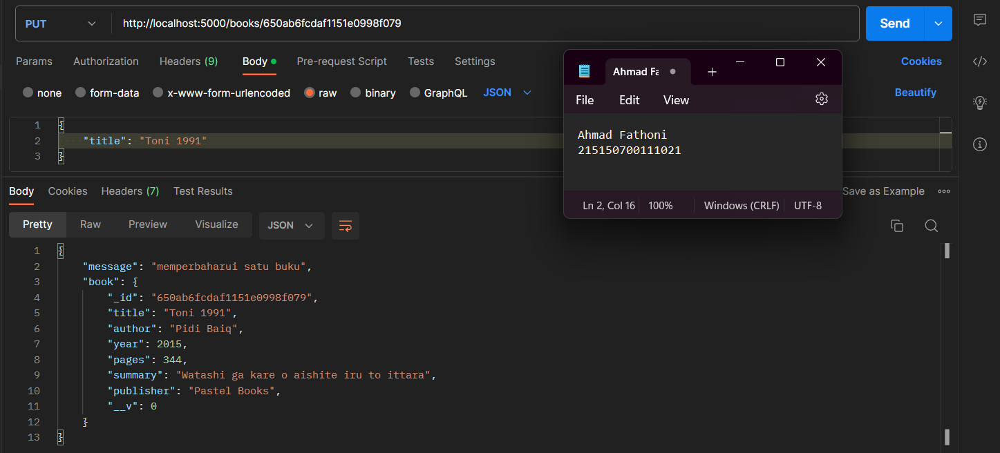

8. Melakukan perubahan pada fungsi deleteBook di controller seperti pada gambar di bawah.
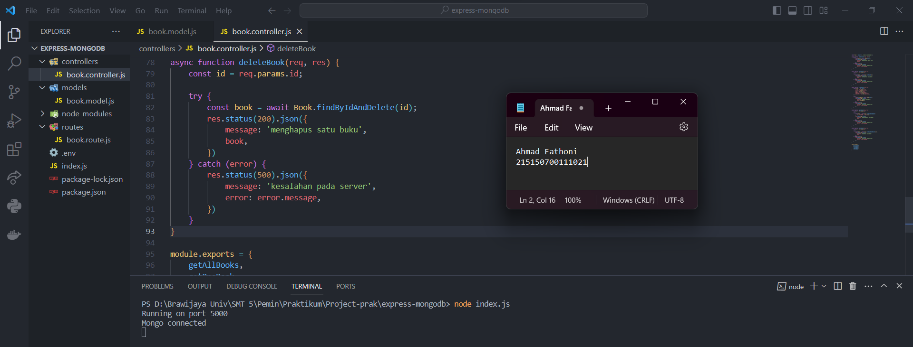

9. Eksekusi endpoint untuk delete buku Dilan 1990
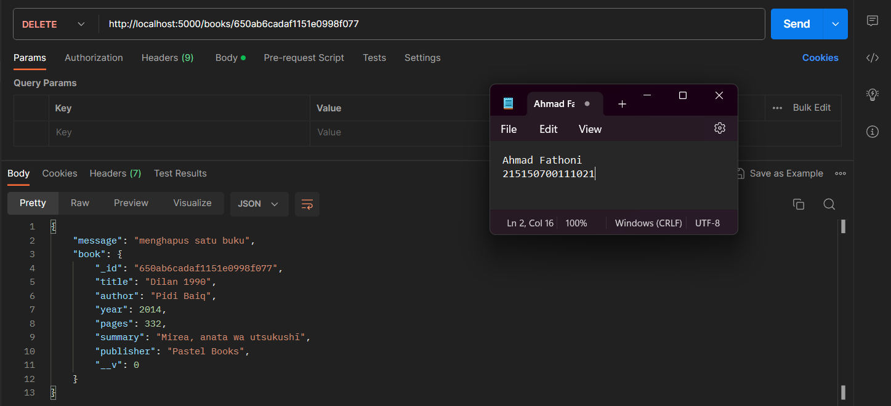


