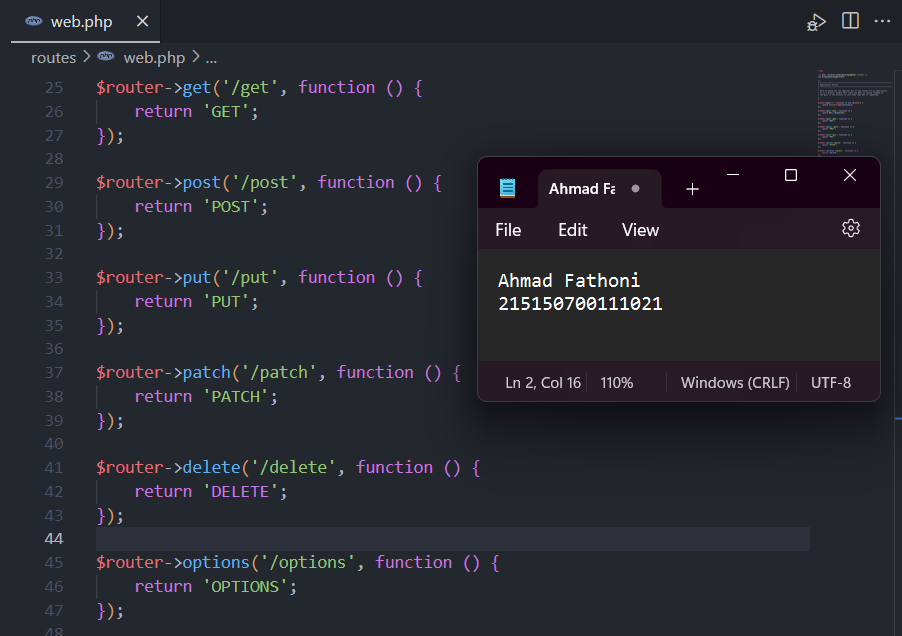

# :ledger: Basic Routing dan Migration

Disini kumpulan code dan foto hasil Screenshot penerapan praktikum saya di modul 4 Basic Routing dan Migration.
## :bookmark: Tujuan
Setelah mengikuti praktikum ini, diharapkan dapat:
1. Melakukan basic routing
2. Mengakses routing
3. melakukan migration ke database

## :scroll: Langkah Percobaan
### Basic Routing dan Akses Routing
1. Menambahkan endpoint dengan method GET pada file web.php pada folder routes, code bisa dilihat pada gambar. Setelah itu, coba jalankan server dengan command 
```
php -S localhost:8000 -t public
```

&nbsp;&nbsp;&nbsp;&nbsp;&nbsp;Setelah server dijalankan, buka browser dengan url ```http://localhost:8000/get```, path yang diakses akan berbentuk ```http://{BASE_URL}{PATH}```, jika BASE_URL adalah ```localhost:8000``` dan PATH nya adalah ```/get```, maka url akan berbentuk seperti gambar dibawah.


2. Menambahkan method POST, PUT, PATCH, DELETE dan OPTIONS pada file web.php, code sama dengan menambahkan method GET pada langkah pertama.


3. Menginstall ekstensi thunder client pada VSCode


4. Buat Request dengan menekan "New Request" pada ekstensi thunder client. Setelah itu mencoba endpoint yang sudah ditambahkan pada file web.php


> [!IMPORTANT]
> Bisa dilihat dalam log di terminal, saya sudah mencoba semua endpoint yang ditambahkan sebelumnya yaitu POST, PUT, PATCH, DELETE, dan OPTIONS 

### Migrasi Database

1. Menyalakan server database dan membuat database dengan nama ```lumenapi```


2. Konfigurasi database pada file ```.env``` dengan mengisikan DB_DATABASE atau nama database, DB_USERNAME atau username database, dan DB_PASSWORD atau password database. Isikan sesuai dengan server database masing-masing. Setelah itu perlu menghidupkan beberapa library bawaan dari lumen dengan membuka file app.php pada folder bootstrap, untuk lebih jelasnya bisa dilihat pada gambar.


3. Menjalankan command dibawah ini untuk membuat file migration.
```
php artisan make:migration create_users_table # membuat migrasi untuk tabel users
php artisan make:migration create_products_table # membuat migrasi untuk tabel products
```
> [!NOTE]
> 2 file akan terbuat pada folder ```database/migrations``` dengan format YYYY_MM_DD_HHmmss_nama_migrasi.  


4. Mengubah fungsi up pada file migrasi ```create_users_table``` dan ```create_products_table``` seperti pada gambar dibawah. Setelah itu jalankan dengan command 
```
php artisan migrate
```


5. Cek database **lumenapi**, seharusnya terbuat 2 tabel, yaitu tabel users dan tabel products


