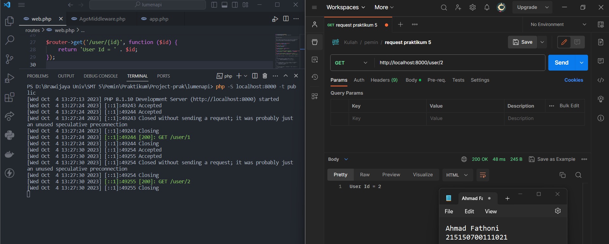
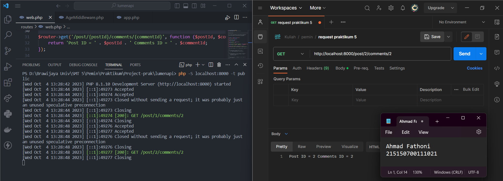
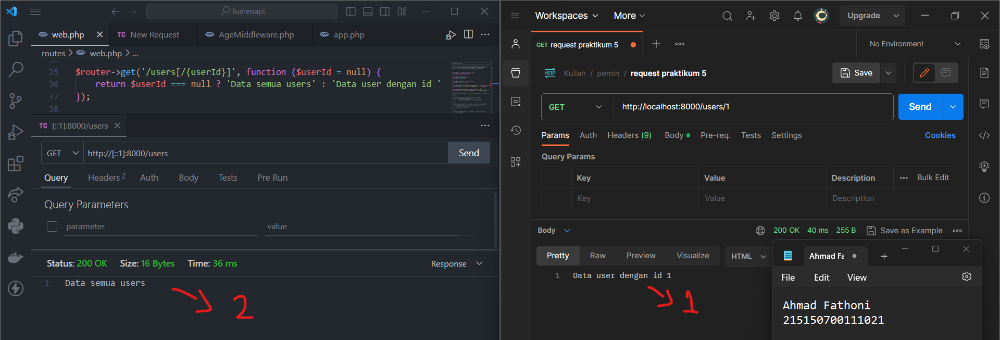
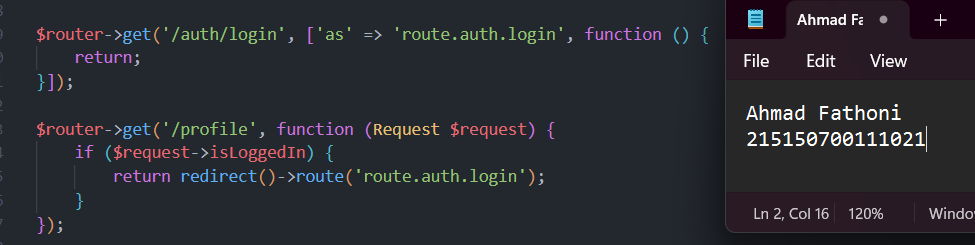
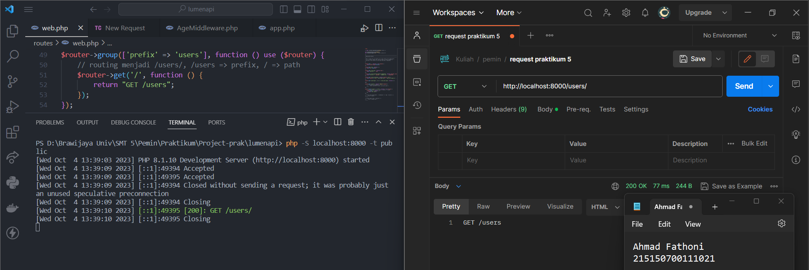
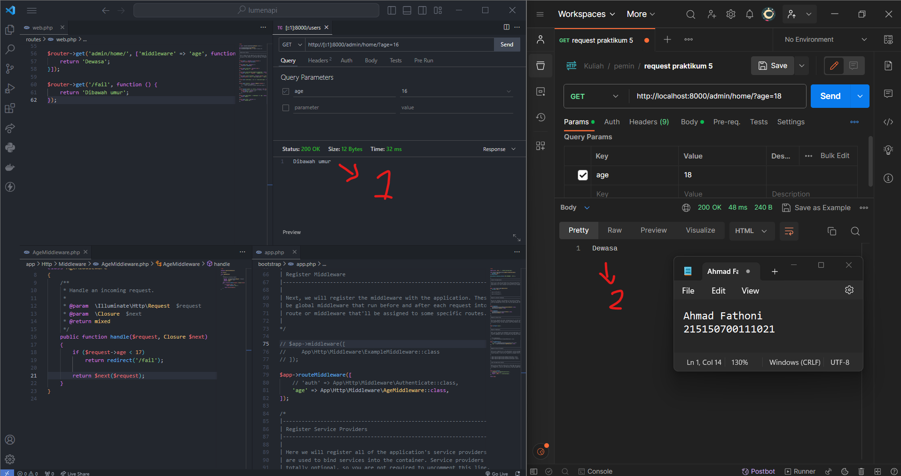

# :ledger: Dynamic Route dan Middleware

Disini kumpulan code dan foto hasil Screenshot penerapan praktikum saya di modul 5 Dynamic Route dan Middleware.

## :bookmark: Tujuan

Setelah mengikuti praktikum ini, diharapkan dapat:

1. Melakukan dinamic routing
2. Melakukan alias route
3. Melakukan group route
4. Melakukan Middleware

## :scroll: Langkah Percobaan

1. Dynamic Route  
   Dynamic route adalah route yang dapat berubah-ubah parameter path nya, contohnya pada saat membuka seuatu halaman web, kadang kita melihat `/users/1` atau `/users/2`, hal ini yang dinamakan dynamic routes.

   

   Bisa dilihat pada gambar di atas, terdapat syntax untuk membuat dynamic routes dan cara eksekusi nya pada postman. Parameter yang ada dalam url bisa diambil dan ditampilkan.

   Kita juga bisa menambahkan banyak parameter pada routes, namun kita dapat menambahkan sebanyak yang diperlukan seperti pada gambar dibawah.

   

   Serta, pada dynamic routes juga bisa menambahkan **optional routes**, yang mana optional routes tidak mengharuskan kita untuk memberi variable pada endpoint kita, namun saat kita memanggil endpoint, dapat menggunakan parameter variable ataupun tidak. Untuk syntax dan eksekusinya bisa dilihat pada gambar dibawah.

   

   Fungsi **optional routes** bisa dilihat pada gambar saat eksekusi endpoint pada nomor 1 dan 2. Jika menggunakan parameter variable ataupun tidak, maka luaran yang ditampilkan dapat berbeda sesuai dengan apa yang kita mau. Dalam kode tersebut, pembuatan sebuah ternary operator untuk mengatur luaran dari optional routes.

2. Aliases Route  
   Aliases Route digunakan untuk memberi nama pada route yang telah kita buat, hal ini dapat
   membantu kita, saat kita ingin memanggil route tersebut pada aplikasi kita. Berikut contoh penggunaan dari **Aliases Route**.

   

   **Penjelasan :**  
   routing untuk `/auth/login` dibuat Aliases Route yaitu `route.auth.login'` dan digunakan pada route `/profile`, yang dimana jika user telah login maka akan langsung diarahkan (redirect) ke route `route.auth.login`.

3. Groupe Route  
   Groupe route digunakan untuk melakukan grouping pada routes agar lebih mudah saat penulisan route pada `web.php`. Penggunaan Groupe route bisa dilihat pada gambar dibawah.

   

   **Penjelasan :**  
   Membuat route `get('/')` di dalam router group prefix `users`, yang berarti untuk mengeksekusi endpoint tersebut menggunakan routing `/users/` seperti pada gambar eksekusi endpoint postman di atas.

   Selain dapat mengelompokkan prefix, kita juga dapat mengelompokkan middleware dan namespace pada kelompok routes yang kita buat.

4. Middleware  
   Middleware adalah penengah antara komunikasi aplikasi dan client. Middleware biasanya digunakan untuk membatasi siapa yang dapat berinteraksi dengan aplikasi kita dan semacamnya, kita dapat menambahkan middleware pada folder `app/Http/Middleware`.
   
   

   **Penjelasan :**
   - Gambar pojok kiri bawah :  
   Membuat **AgeMiddleware** untuk memeriksa jika request dibawah 17 maka akan langsung diarahkan (redirect) ke route `'/fail'` dan jika tidak maka akan tetap melanjutkan sesuai routing yang digunakan untuk middleware ini.

   - Gambar pojok kanan bawah :   
   Menambahkan **AgeMiddleware** pada aplikasi kita, untuk mendaftarkannya ada di file `bootstrap/app.php`. Untuk menambahkan middleware pada aplikasi kita, kita dapat men-uncomment baris 75 hingga 77, kemudian menambahkan age middleware ke dalamnya. Namun, karena kita hanya ingin menambahkan middleware pada route tertentu, kita akan menghapus comment pada baris 79 hingga 81, kemudian menambahkan middleware age di dalamnya, seperti pada gambar di atas.

   - Gambar pojok kiri atas :  
   Menambahkan middleware **AgeMiddleware** pada routes `/admin/home/`

   - Gambar nomor 1 :  
   Eksekusi endpoint `/admin/home/` jika age kurang dari 17. Outputnya adalah `Dibawah Umur` dikarenakan dari **AgeMiddleware** terdapat pemeriksaan jika request dibawah 17 maka akan langsung diarahkan (redirect) ke route `'/fail'`

   - Gambar nomor 2 :  
   Eksekusi endpoint `/admin/home/` jika age lebih dari 17. Outputnya adalah `Dewasa` dikarenakan dari **AgeMiddleware** jika age lebih dari 17 maka pemeriksaan tidak akan di eksekusi dan akan lanjut untuk print `Dewasa`.