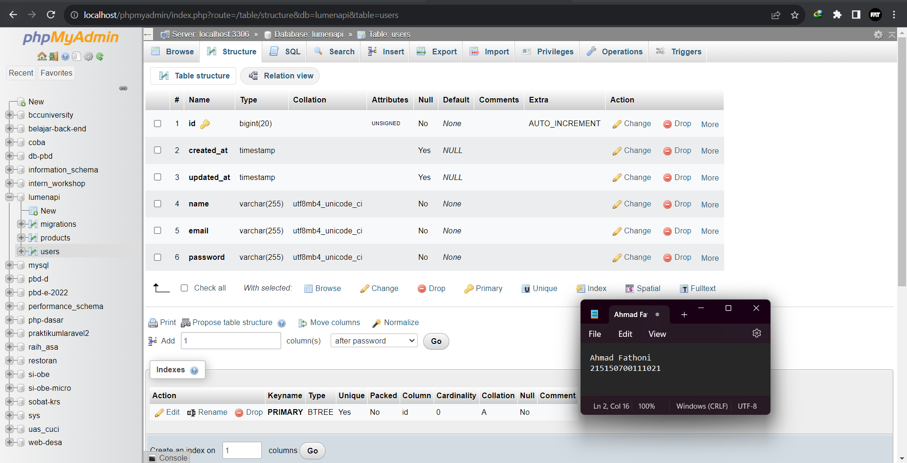

# :ledger: Model, Controller, dan Request-Response Handler

Disini kumpulan code dan foto hasil Screenshot penerapan praktikum saya di modul 3 MongoDB dan Express.

## :memo: Dasar Teori

### Model

Model merupakan bagian yang bertugas untuk menyiapkan, mengatur, memanipulasi, dan mengorganisasikan data yang ada di database. Model merepresentasikan kolom apa saja yang ada pada databas, termasuk relasi dan primary key dapat didefinisikan di dalam model. Dengan menggunakan perintah Artisan, pembuatan model pada Laravel dapat dilakukan dengan satu perintah menggunakan

```php
php artisan make:model nama_model
```

Namun karena perintah Artisan yang terbatas pada Lumen, pembuatan model harus dilakukan secara manual.

### Controller

Controller merupakan bagian yang menjadi tempat berkumpulnya logika pemrograman yang digunakan untuk memisahkan organisasi data pada database. Dalam beberapa kasus, controller menjadi penghubung antara model dan view pada arsitektur MVC

### Request Handler

Request handler adalah fungsi yang digunakan untuk berinteraksi dengan request yang datang. Request handler dapat digunakan untuk melihat apa saja yang dikirimkan oleh user seperti parameter, query, dan body.

### Response Handler

Response handler adalah fungsi yang digunakan untuk membentuk output yang diharapkan kepada user dan beberapa properti selain data seperti status code dan header.

## :scroll: Langkah Percobaan

### Model

1. Pastikan terdapat tabel users yang dibuat menggunakan migration pada bab sebelumnya.

| name      |
| --------- |
| id        |
| createdAt |
| updatedAt |
| name      |
| email     |
| password  |



2. Edit `User.php` di dalam 
