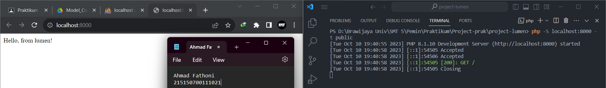

# :ledger: Model, Controller, dan Request-Response Handler

Disini kumpulan code dan foto hasil Screenshot penerapan praktikum saya di modul 6 Model, Controller, dan Request-Response Handler.

## :memo: Dasar Teori

### Model

Model merupakan bagian yang bertugas untuk menyiapkan, mengatur, memanipulasi, dan mengorganisasikan data yang ada di database. Model merepresentasikan kolom apa saja yang ada pada databas, termasuk relasi dan primary key dapat didefinisikan di dalam model. Dengan menggunakan perintah Artisan, pembuatan model pada Laravel dapat dilakukan dengan satu perintah menggunakan

```
php artisan make:model nama_model
```

Namun karena perintah Artisan yang terbatas pada Lumen, pembuatan model harus dilakukan secara manual.

### Controller

Controller merupakan bagian yang menjadi tempat berkumpulnya logika pemrograman yang digunakan untuk memisahkan organisasi data pada database. Dalam beberapa kasus, controller menjadi penghubung antara model dan view pada arsitektur MVC

### Request Handler

Request handler adalah fungsi yang digunakan untuk berinteraksi dengan request yang datang. Request handler dapat digunakan untuk melihat apa saja yang dikirimkan oleh user seperti parameter, query, dan body.

### Response Handler

Response handler adalah fungsi yang digunakan untuk membentuk output yang diharapkan kepada user dan beberapa properti selain data seperti status code dan header.

## :scroll: Langkah Percobaan

### Model

1. Pastikan terdapat tabel users yang dibuat menggunakan migration pada bab sebelumnya.

&nbsp;&nbsp;&nbsp;&nbsp;&nbsp;&nbsp;&nbsp;

2. Melakukan edit model `User.php` yang ada di dalam path `app/Models/`

   

   Model User tersebut merepresentasikan kolom yang ada pada database. `$fillable` berguna untuk mendaftarkan atribut (nama kolom) yang bisa kita isi ketika melakukan insert atau update ke database. `$hidden` digunakan untuk menyembunyikan atribut model (kolom tabel) ketika model di-serialize menjadi JSON.

### Controller

1. Salin **ExampleController.php** pada folder `app/Http/Controllers`, ganti namanya menjadi **HomeController.php** dan membuat fungsi `index()`.

   

   Fungsi `index()` tersebut hanya akan mereturn sebuah string `Hello, from lumen` yang nantinya string tersebut akan ditampilkan saat di eksekusi.

2. Mengubah route `/` pada file `routes/web.php` menjadi seperti gambar dibawah

   

   Route `/` tersebut mendefinisikan sebuah route dengan HTTP method GET yang akan menanggapi request pada URL `'/'`. `'uses' => 'HomeController@index'` mengindikasikan bahwa route ini akan menggunakan controller `HomeController` dan menjalankan method `index` pada controller tersebut ketika route diakses.

3. Menjalankan aplikasi untuk melihat hasilnya.

   

### Request Handler

1. Melakukan import library Request, setelah itu merubah fungsi index dalam file `HomeController.php` menjadi seperti pada gambar dibawah dan mencoba menjalankan aplikasi untuk melihat hasilnya.

   

   Fungsi index tersebut dirubah dengan menambahkan parameter `Request` yang digunakan untuk mengakses data yang terkait dengan permintaan HTTP yang diterima. `$request->path()` memanggil method `path()` pada objek `$request` untuk mendapatkan path dari permintaan HTTP yang diterima. Path adalah bagian dari URL setelah domain, dalam case tersebut path yang digunakan untuk mengeksekusi fungsi tersebut adalah `/`.

### Response Handler

1. Melakukan import library Response dan membuat fungsi `hello()` dalam file `HomeController.php`seperti pada gambar dibawah.

   

   Dalam fungsi `hello()` tersebut terdapat `$data['status'] = 'Success';` dan `$data['message'] = 'Hello, from lumen!';` yang nantinya data tersebut akan dikirimkan sebagai respons JSON. Terdapat juga `return (new Response($data, 201))->header('Content-Type', 'application/json');` Ini adalah pernyataan yang mengembalikan respons kepada pengguna. Respons yang dikirimkan adalah objek Response yang berisi data (`$data`), data tersebut isi-nya sudah dideklarasikan di awal, serta kode status HTTP 201 (Created) dan header 'Content-Type' yang diatur ke 'application/json', menandakan bahwa tipe konten respons adalah JSON.

2. Menambahkan route `/hello` pada file `routes/web.php`

   

   Route `/hello` tersebut mendefinisikan sebuah route dengan HTTP method GET yang akan menanggapi request pada URL `'/hello'`. `'uses' => 'HomeController@hello'` mengindikasikan bahwa route ini akan menggunakan controller `HomeController` dan menjalankan fungsi `hello` pada controller tersebut ketika route diakses.

3. Menjalankan aplikasi untuk melihat hasilnya.

   

## :open_book: Penerapan

1. Melakukan import model User ke dalam file `HomeController.php`.

   

   Fungsi import model User tersebut yaitu untuk melakukan operasi yang terkait dengan pengguna `(user)`, seperti membuat user baru `(create)`, mendapatkan pengguna `(get)`, dan lain sebagainya.

2. Menambahkan ketiga fungsi seperti pada gambar dibawah di dalam `HomeController.php`.

   

   - Fungsi `defaultUser()` : fungsi ini untuk membuat user baru yang nilai dari user yang akan dibuat sudah ditentukan. `User::create()` digunakan untuk membuat dan menyimpan rekaman data user baru ke dalam database. Response yang dikembalikan dalam format JSON yang mencakup status, message, dan data pengguna baru yang dibuat.

   - Fungsi `createUser(Request $request)` : fungsi ini untuk membuat user baru berdasarkan data yang diterima dari permintaan HTTP (Request). Data seperti nama, email, password pengguna diambil dari permintaan, kemudian digunakan untuk membuat pengguna baru. Response yang dikembalikan dalam format JSON yang mencakup status, message, dan data pengguna baru yang dibuat.

   - Fungsi `getUsers()` : fungsi ini untuk mendapatkan seluruh data user dari database. `User::all()` digunakan untuk mengambil semua pengguna dari database menggunakan model User. Kemudian mengembalikan respons dalam format JSON yang mencakup status, message, dan data seluruh pengguna.

3. Menambahkan ketiga route pada file `routes/web.php` dengan menggunakan group route.

   

   Route untuk mengeksekusi ketiga fungsi yang sudah dibuat di `HomeController.php` menggunakan group route dengan prefix `users`, yang berarti untuk mengeksekusi route `'/default'`, `'/new'`, `'/all'` tersebut menggunakan routing yang diawali dengan `/users`.

4. Mencoba menjalankan endpoint `users/default` dengan menggunakan Postman untuk melihat hasilnya.

   

    **Hasil Eksekusi :**

   

5. Mencoba menjalankan endpoint `users/new` dengan mengisi body seperti pada gambar dibawah menggunakan postman.

   

    **Hasil Eksekusi :**

   

6. Mencoba menjalankan endpoint `users/all`.

   
