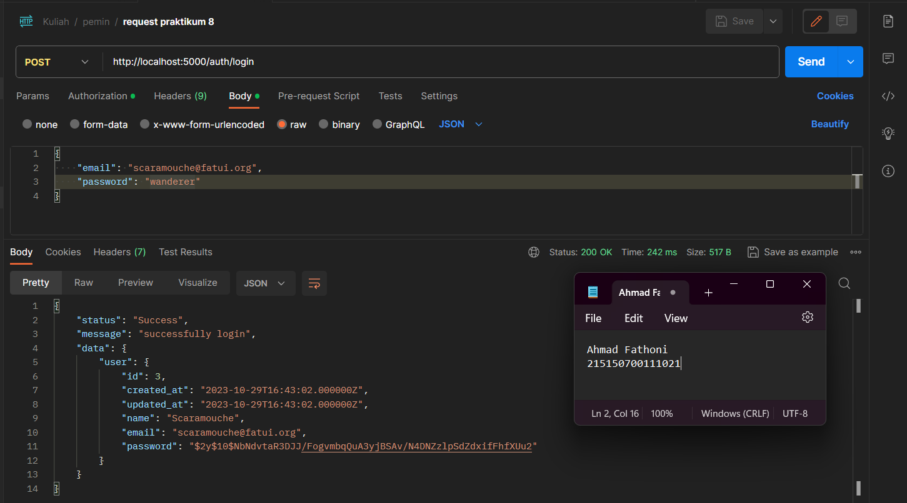
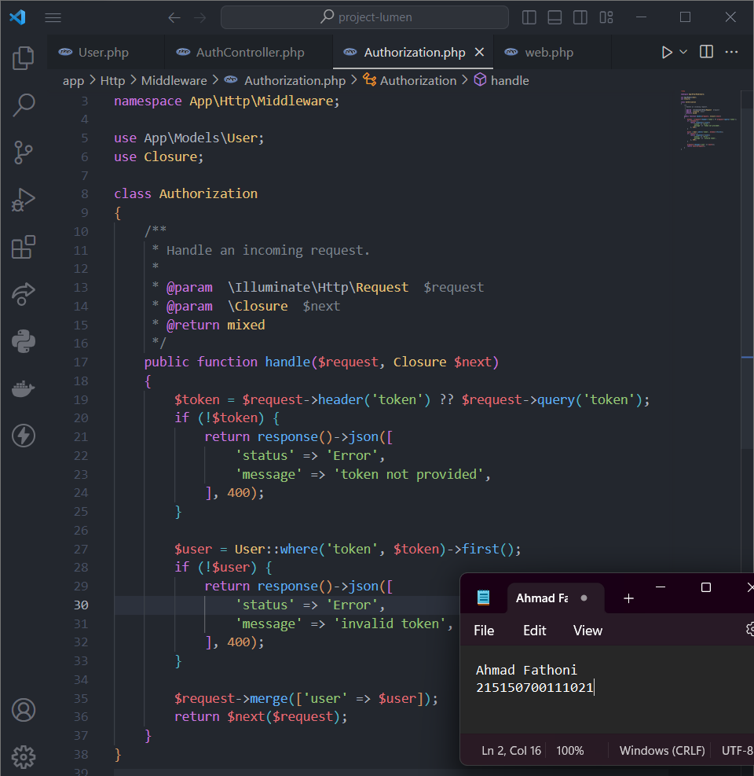

# :ledger: Register, Authentication dan Authorization

Disini kumpulan code dan foto hasil Screenshot penerapan praktikum saya di modul 8 Register, Authentication dan Authorization.

## :memo: Dasar Teori

### Authentication

Otentifikasi adalah proses untuk mengenali identitas dengan mekanisme pengasosiasian permintaan yang masuk dengan satu set kredensial pengidentifikasi. Kredensial yang diberikan akan dibandingkan dengan database informasi pengguna yang berwenang di dalam sistem operasi lokal atau server otentifikasi.

### Token

Token merupakan nilai yang digunakan untuk mendapatkan akses ke sumber daya yang dibatasi secara elektronik. Penggunaan token ditujukan pada web service yang tidak menyimpan state yang berkaitan dengan penggunaan aplikasi (stateless) seperti session.

### Authorization

Authorization merupakan proses pemberian hak istimewa yang dilakukan setelah proses authentication. Setelah pengguna diidentifikasi pada proses authentication, authorization akan memberikan hak istimewa dan tindakan yang diizinkan kepada pengguna yang ditentukan.

## :scroll: Langkah Percobaan

### Register

1. Pastikan terdapat tabel users yang sudah dibuat pada bab 3 **Basic Routing dan Migration**.

   

2. Pastikan sudah terdapat model **User.php** yang digunakan pada bab 5 **Model, Controller, dan Request-Response Handler**.

   

3. Membuat file **AuthController.php** dengan isian baris kode seperti dibawah.

   

4. Menambahkan routes baru di `routes/web.php`

   

5. Menjalankan aplikasi dan mencoba endpoint `/auth/register` dengan request body seperti dibawah.

   

### Authentication

1. Membuat fungsi `login(Request $request)` pada file **AuthController.php**

   

2. Menambahkan routes baru di `routes/web.php`

   

3. Menjalankan aplikasi dan mencoba endpoint `/auth/login` dengan request body email dan password yang sesuai

   

4. Mengeksekusi endpoint `auth/login` dengan request body email yang salah, tetapi password yang benar

   

5. Mengeksekusi endpoint `auth/login` dengan request body email yang benar, tetapi password yang salah

   

### Token

1. Membuat file migrasi baru dengan menjalankan perintah seperti pada gambar dibawah

   

2. Menambahkan baris kode pada file migration yang baru terbuat

   

3. Menambahkan atribut token pada `$fillable` di file **User.php**

   

4. Menambahkan baris kode pada file **AuthController.php**

   

5. Mengeksekusi file migrasi yang sudah dibuat dengan command `php artisan migrate`

   

6. Menjalankan aplikasi dan mencoba endpoint `/auth/login` dengan request body seperti dibawah, serta menyalin token dari response jika sukses login.

   

### Authorization

1. Membuat file **Authorization.php** pada folder di path `App/Http/Middleware` dan mengisi baris kode seperti pada gambar dibawah.

   

2. Menambahkan middleware sudah dibuat pada `bootstrap/app.php`

   

3. Membuat fungsi `home()` pada **HomeController.php**

   

4. Memambahkan routes baru pada `routes/web.php`

   

5. Menjalankan aplikasi dan mencoba endpoint `/home` dengan melampirkan nilai token yang didapatkan dari login user pada **headers**

   
