# :ledger: JSON Web Token (JWT)

Disini kumpulan code dan foto hasil Screenshot penerapan praktikum saya di modul 9 JSON Web Token (JWT).

## :memo: Dasar Teori

### JSON Web Token

JSON Web Token (JWT) adalah standar terbuka yang mendefinisikan cara ringkas dan mandiri untuk transmisi informasi antar pihak secara aman dalam bentuk objek JSON. Informasi ini dapat diverifikasi karena ditandatangani secara digital menggunakan secret key (dengan algoritma HMAC) atau pasangan kunci publik/pribadi menggunakan RSA atau ECSDA

#### Penggunaan

- Authorization <br/>
  Setelah user masuk, setiap request perlu menyertakan. Hal ini mengizinkan user untuk mengakses route, service, dan resource yang diizinkan menggunakan token.
- Information Exchange <br/>
  JWT dapat digunakan untuk mengamankan transmisi data antar pihak. Hal ini dimungkinkan karena JWT dapat ditandatangani untuk memastikan data dikirimkan oleh pengirim yang benar. Penggunaan signature yang dihitung dengan header dan payload dapat memverifikasi data yang dikirimkan tidak diubah di tengah jalan.

### Struktur

JSON Web Token menggunakan pola berikut. Header, payload, signature dipisahkan dengan titik.

```
xxxxx.yyyyy.zzzzz
```

- Header <br/>
  Berisi algoritma yang digunakan serta jenis token.

  ```
  {
    "alg": "HS256",
    "typ": "JWT"
  }
  ```

  Data di atas akan di-encode menjadi Base64

  ```
  eyJhbGciOiJIUzI1NiIsInR5cCI6IkpXVCJ9
  ```

- Payload <br/>
  Berisi data yang ditransmisikan. Walaupun JWT memastikan dapat yang dikirim tidak diubah, Base64 yang digunakan dapat di-decode. Hal ini membuat JWT tidak dapat digunakan untuk transmisi data rahasia seperti plain text password.

  Data di atas akan di-encode menjadi Base64

  ```
  eyJzdWIiOiIxMjM0NTY3ODkwIiwibmFtZSI6Ik5pbG91IiwiaWF0IjoxNTE2MjM5MDIyfQ
  ```

- Signature <br/>
  Hasil penandatanganan yang dilakukan dengan header dan payload yang sudah di-encode diikuti dengan secret key menggunakan algoritma yang didefinisikan di header.

  Proses penandatanganan menggunakan rumus sebagai berikut

  ```
  HMACSHA256(
    base64UrlEncode(header) + "." +
    base64UrlEncode(payload),
    secret)
  ```

  Yang menghasilkan signature sebagai berikut

  ```
  58_9vUl1BQN7Fpqs7u7r4tyJC_wvFJ5n4GibGTVnGpU
  ```

## :scroll: Langkah Percobaan

### Penyesuaian Database

1. Melakukan perubahan pada length kolom token dengan menghapus parameter 72 di belakangnya.

   ```
   // from this
   public function up()
   {
       Schema::table('users', function (Blueprint $table) {
           $table->string('token', 72)->unique()->nullable(); //
       });
   }

   // to this
   public function up()
   {
       Schema::table('users', function (Blueprint $table) {
           $table->string('token')->unique()->nullable();
       });
   }
   ```

   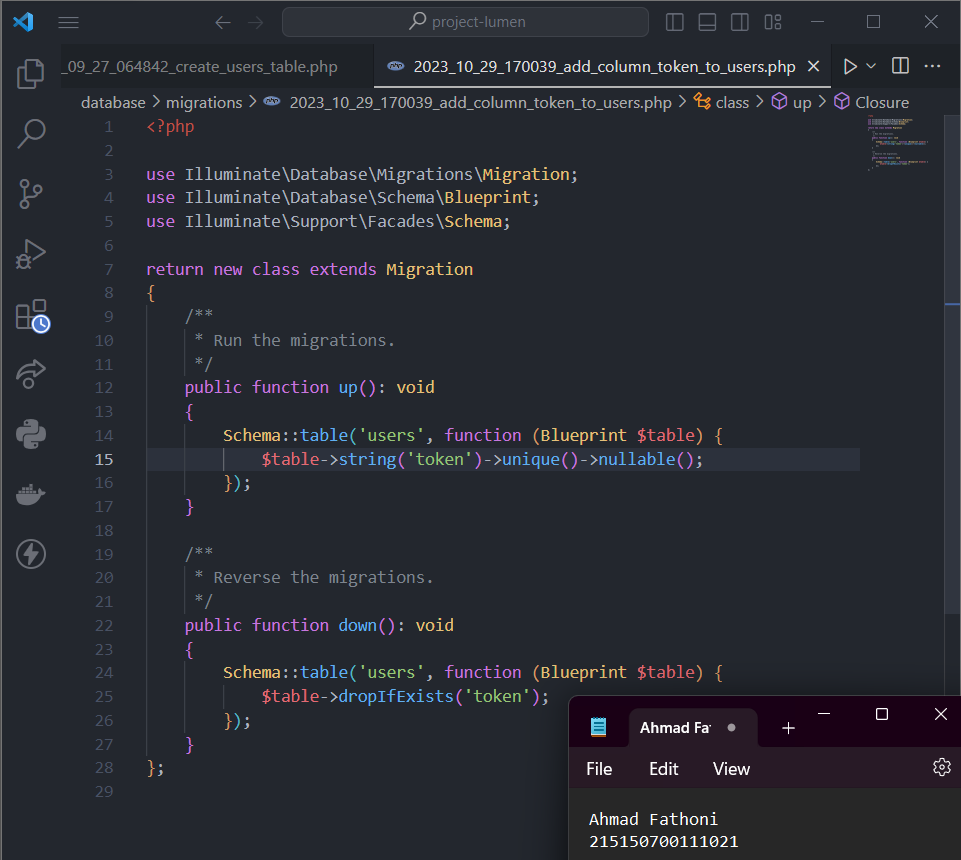

2. Menjalankan perintah `php artisan migrate:fresh` untuk memperbaharui migrasi dan menghapus data yang lama.

   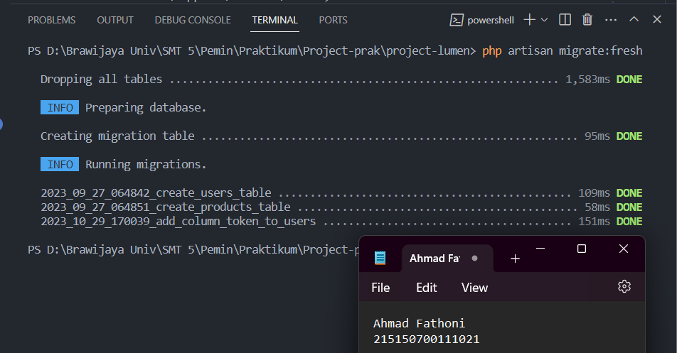

3. Menjalankan aplikasi pada endpoint `/auth/register` dengan body request seperti pada gambar dibawah.

   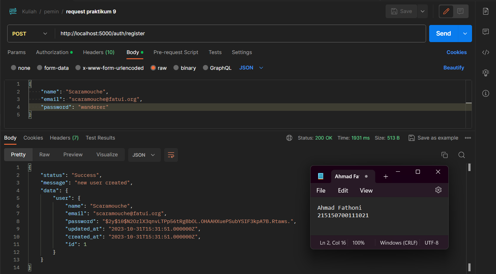

### JWT Manual

1. Menambahkan ketiga fungsi seperti pada gambar pada `AuthController.php`.

   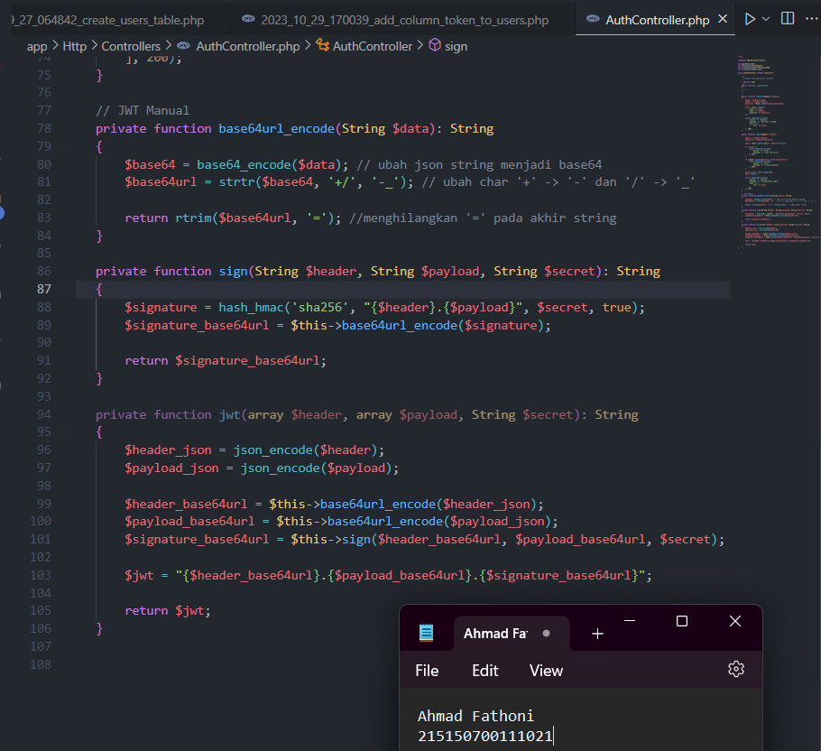

   Penjelasan ketiga fungsi pada gambar : <br>

   1. **base64url_encode(String $data): String**

      Fungsi ini digunakan untuk mengubah data string menjadi bentuk URL-safe Base64. Pada tahap ini merupakan langkah pertama dalam menghasilkan payload dan header JWT. Fungsi ini memiliki parameter data string sebagai input.

   2. **sign(String $header, String $payload, String $secret): String**

      Fungsi ini digunakan untuk menghasilkan signature JWT dengan menggunakan HMAC SHA-256. Signature ini akan digunakan untuk memverifikasi integritas JWT. Fungsi ini menerima parameter header, payload, dan secret key sebagai input.

   3. **jwt(array $header, array $payload, String $secret): String**

      Fungsi ini adalah metode utama yang menghasilkan JWT lengkap. Return value dari fungsi ini adalah penggabungan header, payload, dan signature dengan karakter '.' untuk membentuk JWT yang siap digunakan.

2. Melakukan perubahan dengan menambahkan beberapa kode pada fungsi login.

   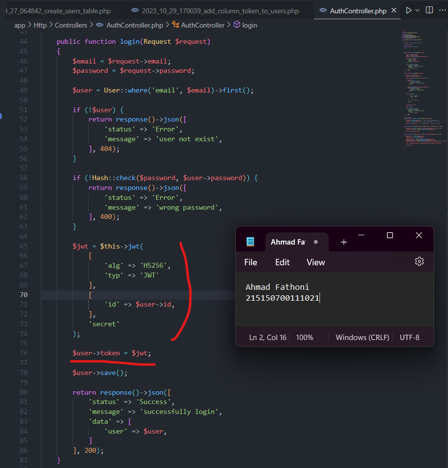

   Perubahan yang dilakukan adalah pemanggilan fungsi `jwt` untuk membuat JSON Web Token (JWT) dengan parameter pertama yang berisi informasi header JWT, parameter kedua berisi payload JWT, dan parameter yang ketiga adalah secret key yang digunakan untuk menghasilkan signature JWT. Hasil dari fungsi tersebut berupa JWT lengkap yang terdiri dari header, payload, dan signature yang disimpan kedalam variable `$jwt`. variable `$jwt` inilah yang akan digunakan untuk mengisi token user.

3. Tambahkan keempat fungsi seperti pada gambar pada `Middleware/Authorization.php`

   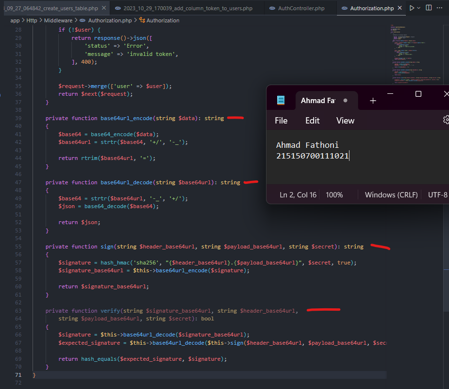

   Inti dari fungsi ini hampir sama dengan ketiga fungsi yang ada di dalam file `AuthController.php`, yang membedakan adalah terdapat fungsi untuk melakukan kebalikan dari `base64url_encode`, yaitu `base64url_decode` yang mengambil string Base64 dan dikembalikan menjadi data string asli. Serta terdapat fungsi `verify` untuk memeriksa apakah signature JWT yang diberikan cocok dengan signature yang dihasilkan dari header dan payload yang diberikan.

4. Melakukan perubahan pada fungsi handle pada `Middleware/Authorization.php`

   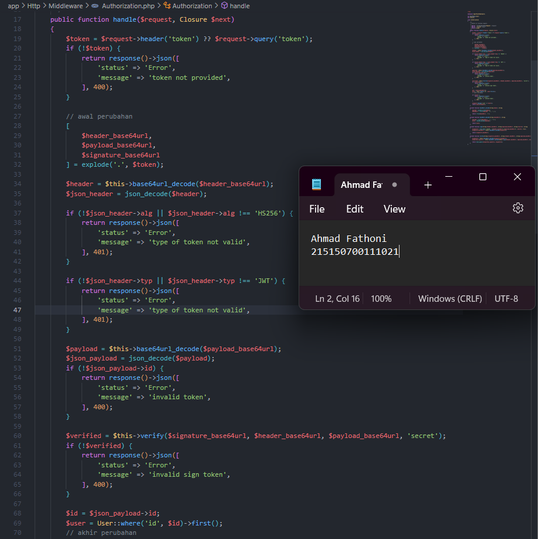

   Perubahan yang dilakukan tersebut untuk memeriksa dan memverifikasi token yang dikirimkan oleh klien sebelum mengizinkan ke akses ke sumber daya terlindungi dengan memanfaatkan keempat fungsi yang sudah dibuat sebelumnya. Jika ada pelanggaran atau token tidak valid, maka respon dengan pesan kesalahan dan kode status yang sesuai akan dikirimkan kembali kepada klien.

5. Menjalankan aplikasi pada endpoint `/auth/login` dengan body seperti pada gambar. Serta menyalin token yang didapat ke notepad.

   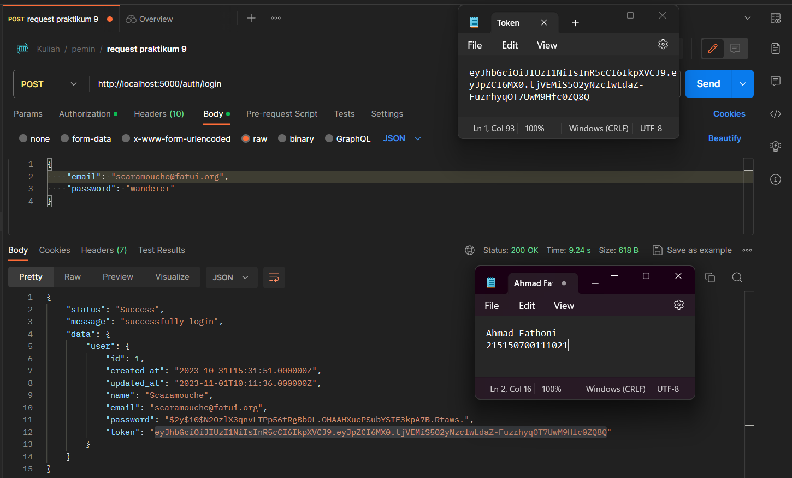

6. Menjalankan aplikasi pada endpoint `/home` dengan melampirkan nilai token yang sudah di salin ke notepad sebelumnya, dari yang didapat setelah login pada header.

   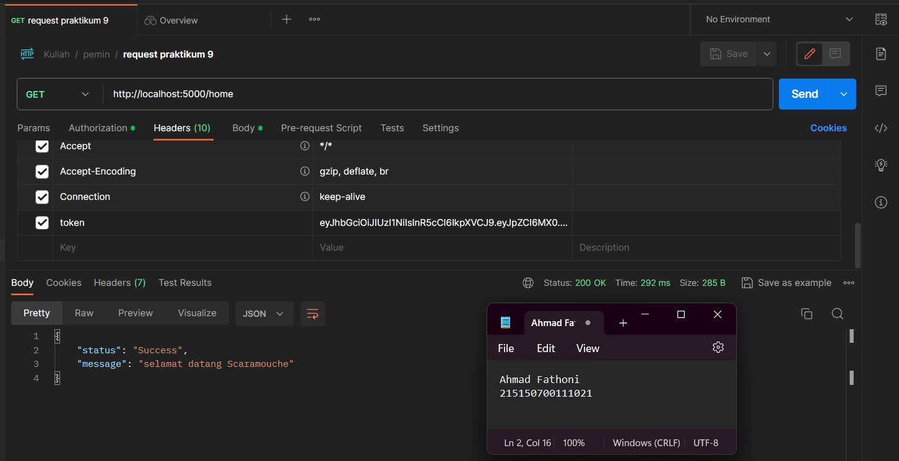

   Response yang dikembalikan dalam endpoint `/home` tersebut adalah pesan sukses, yang berarti token jwt yang berada dalam Headers sudah sesuai dengan pengecekan di dalam file `Authorization`. Hal ini membuat token di headers yang awalnya didapat dari generate random string saja saat login, sekarang menggunakan token jwt yang keamanan datanya lebih terjaga.

### JWT Library

1. Melakukan generate jwt key secara online menggunakan website Djecrety ― Django Secret Key Generator dan memasukkan secret key tersebut pada file `.env` dengan membuat variable baru bernama `JWT_SECRET`.

   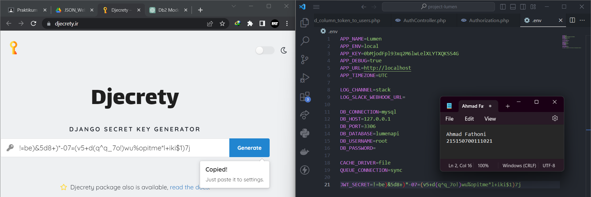

2. Melakukan instalasi package jwt firebase dengan menggunakan command `composer require firebase/php-jwt`

   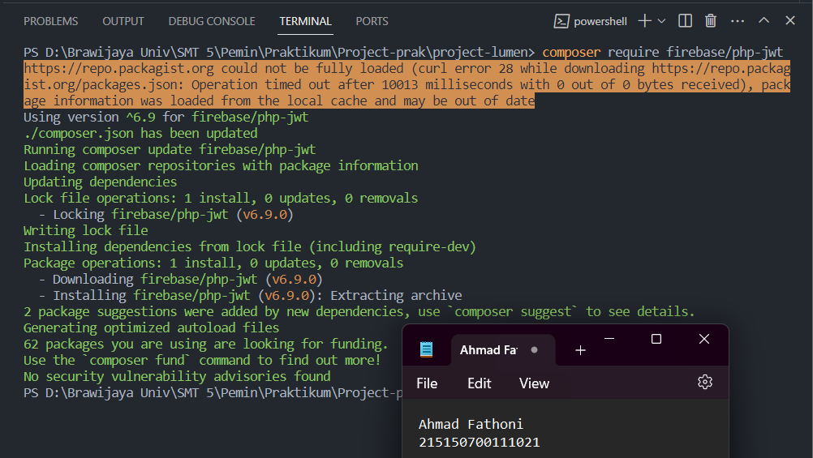

3. Tambahkan fungsi seperti pada gambar di file `AuthController`.

   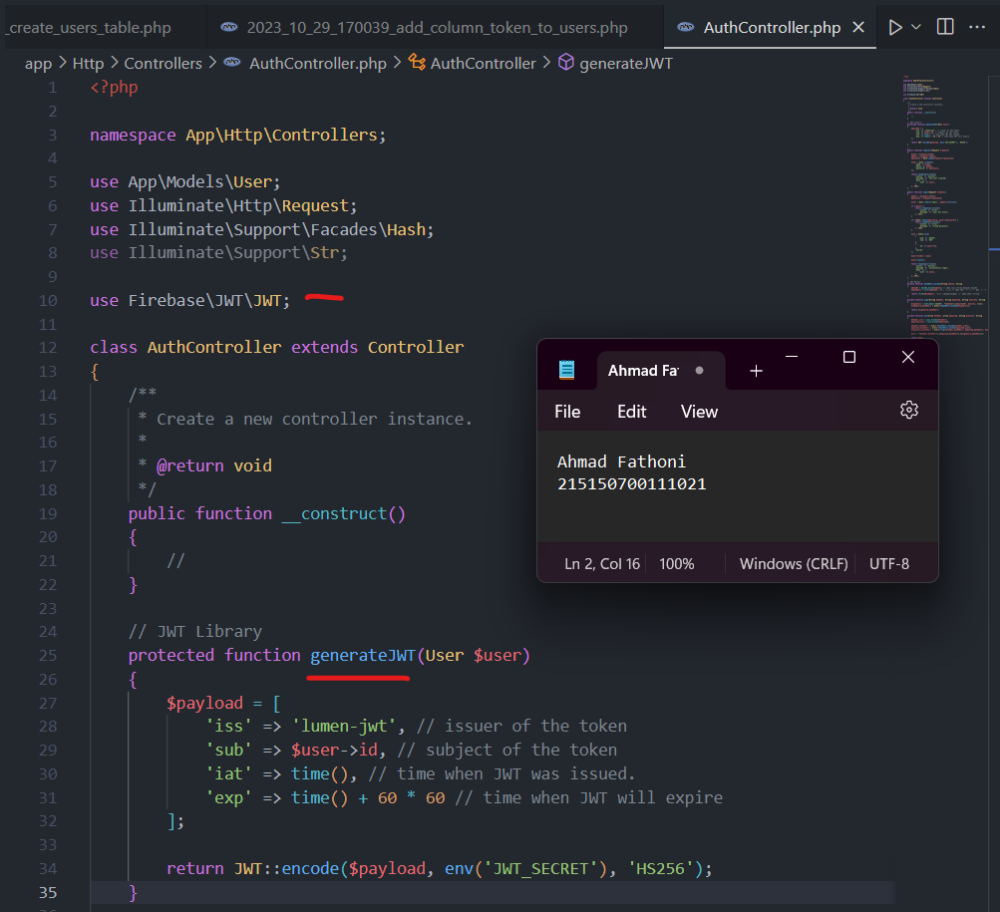

   fungsi `generateJWT` tersebut digunakan untuk membuat token JWT menggubakan library Firebase JWT dengan payload yang sesuai dan mengonversinya ke dalam format string.

4. Melakukan perubahan pada fungsi login menjadi seperti pada gambar.

   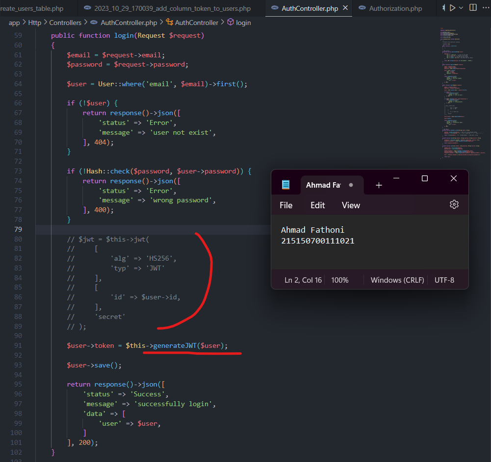

   Merubah pembuatan JWT yang awalnya manual menggunakan fungsi `jwt` sekarang menjadi menggunakan library JWT dari Firebase JWT dengan fungsi `generateJWT`.

5. Membuat file `JwtMiddleware.php` dan mengisikan baris code seperti pada gambar.

   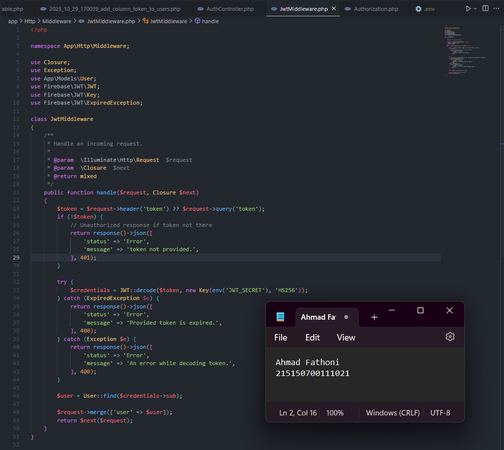

   Fungsi dari `JwtMiddleware.php` ini adalah untuk memeriksa dan mendekode token JWT yang dikirimkan dalam permintaan, dan jika token valid, maka akan diizinkan ke sumber daya terlindungi dengan memberikan informasi pengguna ke permintaan. Jika ada masalah atau kesalahan dengan token, respon dengan pesan kesalahan yang sesuai akan dikirimkan sebagai tanggapan HTTP.

6. Daftarkan middleware yang telah dibuat pada `bootstrap/app.php`

   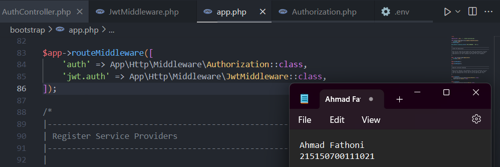

7. Tambahkan baris code seperti pada gambar di file `routes/web.php`.

   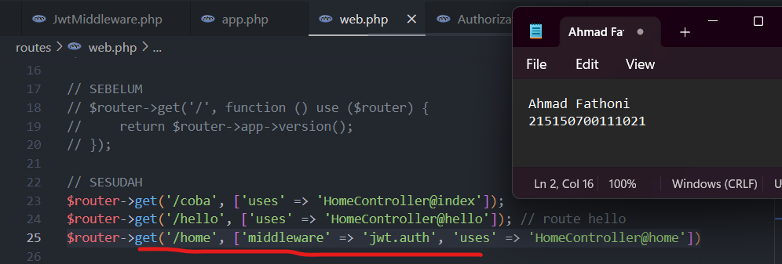

   Merubah middleware yang digunakan adalah `jwt.auth` (sesuai dengan nama middleware yang didaftarkan sebelumnya) pada routes `/home`.

8. Menjalankan aplikasi pada endpoint `/auth/login` dengan request body seperti pada gambar dan menyalin token yang didapat ke notepad.

   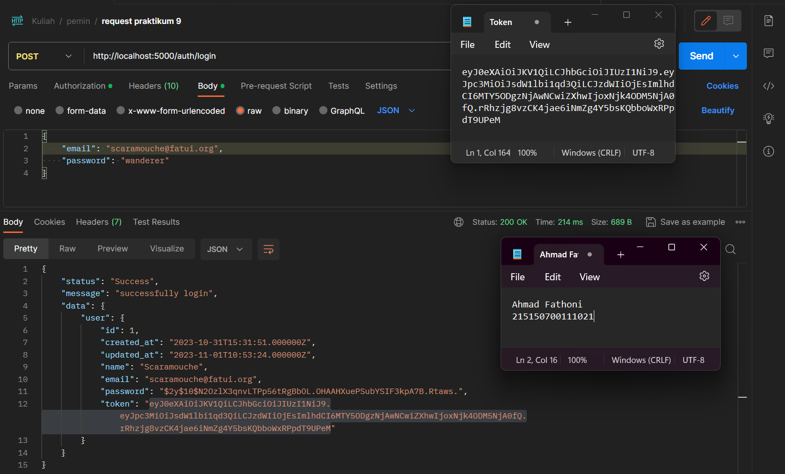

9. Menjalankan aplikasi pada endpoint `/home` dengan melampirkan nilai token yang sudah di salin ke notepad sebelumnya, dari yang didapat setelah login pada header.

   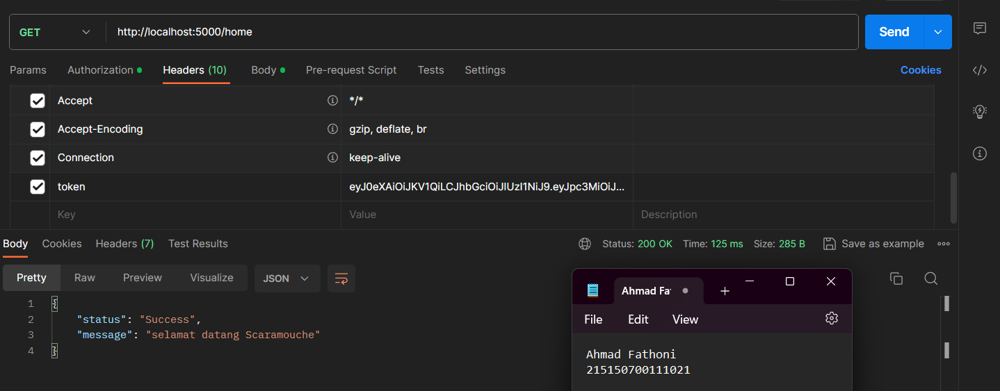

   Hasilnya ini sama saja dengan menggunakan JWT manual sebelumnya, yang membedakan pada kasus ini adalah menggunakan JWT library dari Firebase yang sudah siap pakai.
